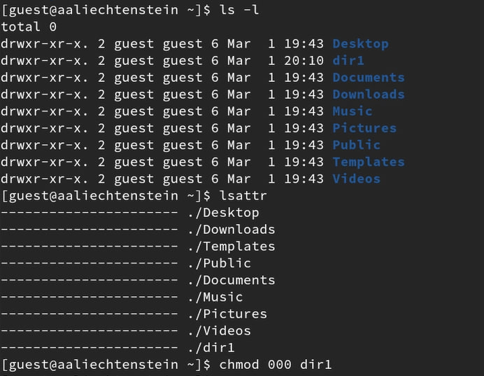

---
## Front matter
title: "ОТЧЕТ О ВЫПОЛНЕНИИ ЛАБОРАТОРНОЙ РАБОТЫ №2"
subtitle: "_дисциплина: Основы информационной безопасности_"
author: "Лихтенштейн Алина Алексеевна"

## Generic otions
lang: ru-RU
toc-title: "Содержание"

## Bibliography
bibliography: bib/cite.bib
csl: pandoc/csl/gost-r-7-0-5-2008-numeric.csl

## Pdf output format
toc: true # Table of contents
toc-depth: 2
lof: true # List of figures
lot: false # List of tables
fontsize: 12pt
linestretch: 1.5
papersize: a4
documentclass: scrreprt
## I18n polyglossia
polyglossia-lang:
  name: russian
  options:
	- spelling=modern
	- babelshorthands=true
polyglossia-otherlangs:
  name: english
## I18n babel
babel-lang: russian
babel-otherlangs: english
## Fonts
mainfont: PT Serif
romanfont: PT Serif
sansfont: PT Sans
monofont: PT Mono
mainfontoptions: Ligatures=TeX
romanfontoptions: Ligatures=TeX
sansfontoptions: Ligatures=TeX,Scale=MatchLowercase
monofontoptions: Scale=MatchLowercase,Scale=0.9
## Biblatex
biblatex: true
biblio-style: "gost-numeric"
biblatexoptions:
  - parentracker=true
  - backend=biber
  - hyperref=auto
  - language=auto
  - autolang=other*
  - citestyle=gost-numeric
## Pandoc-crossref LaTeX customization
figureTitle: "Рис."
tableTitle: "Таблица"
listingTitle: "Листинг"
lofTitle: "Список иллюстраций"
lotTitle: "Список таблиц"
lolTitle: "Листинги"
## Misc options
indent: true
header-includes:
  - \usepackage{indentfirst}
  - \usepackage{float} # keep figures where there are in the text
  - \floatplacement{figure}{H} # keep figures where there are in the text
---

# Цель работы

Целью данной работы является получение практических навыков работы в консоли с атрибутами файлов, закрепление теоретических основ дискреционного разграничения доступа в современных системах с открытым кодом на базе ОС Linuх.

# Выполнение лабораторной работы

В установленной при выполнении предыдущей лабораторной работы операционной системе создадим учётную запись пользователя guest (использую учётную запись администратора)  и зададим ей пароль:

Создадим учетную запись guest и зададим ей пароль (рис. [-@fig:001])

{#fig:001 width=70%}

Определим директорию, в которой мы находитесь, командой pwd. Сравним её с приглашением командной строки. Определим, является ли она нашей домашней директорией? Если нет, зайдем в домашнюю директорию.

Определим директорию командой pwd. (рис. [-@fig:002])

{#fig:002 width=70%}

Уточнение имени пользователя командой whoami.
Использование команд id и groups.

Использование команд whoami, id и groups. (рис. [-@fig:003])

{#fig:003 width=70%}

Просмотрим файл /etc/passwd командой cat /etc/passwd
Найдем в нём свою учётную запись. Определим uid пользователя. Определим gid пользователя. Сравним найденные значения с полученными в предыдущих пунктах - они совпадают.

Использование команды cat /etc/passwd. (рис. [-@fig:004])

{#fig:004 width=70%}

Создадим в домашней директории поддиректорию dir1 командой mkdir dir1.

Использование команды mkdir dir1. (рис. [-@fig:005])

{#fig:005 width=70%}

Определим командами ls -l и lsattr, какие права доступа и расширенные атрибуты были выставлены на директорию dir1. А затем снимем с директории dir1 все атрибуты командой chmod 000 dir1 и проверим с её помощью правильность выполнения команды ls -l.

Использование команд ls -l, lsattr и chmod. (рис. [-@fig:006])

{#fig:006 width=70%}

Попытаемся создать в директории dir1 файл file1 командой echo "test" > /home/guest/dir1/file1. Был получен отказ в выполнение операции по причине того, что мы сняли все атрибуты командой dir1.

Использование команды echo "test" > /home/guest/dir1/file1. (рис. [-@fig:007])

{#fig:007 width=70%}

# Выводы

В процессе выполнения данной лабораторной работы были успешно приобретены практические навыки работы в консоли с атрибутами файлов, закрепление теоретических основ дискреционного разграничения доступа в современных системах с открытым кодом на базе ОС Linuх.
